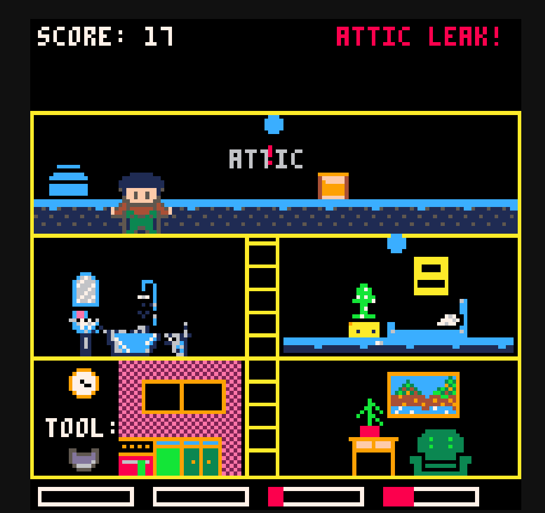

# Dollhouse Leak Fixer

A PICO-8 game made for **Winter MEGA JAM 2025**. Fix leaks in a dollhouse before everything floods!

## What's This About

You're running around a 5-room dollhouse fixing water leaks with different tools. Think old-school ZX Spectrum vibes but with more panic about water damage.

## How It Works

- Run between 5 rooms (kitchen, bedroom, bathroom, living room, attic)
- Grab tools from the kitchen - they cycle every 3 seconds
- Fix leaks with the right tool or you're screwed:
  - Bedroom leaks need pot or rag
  - Bathroom needs wrench or putty  
  - Living room wants plank or putty
  - Attic uses wrench or putty
- Water keeps rising, leaks spawn faster over time
- Don't let everything flood or it's game over

## Controls

Arrow keys to move, Z/X to interact. X restarts when you inevitably lose.

## Playing It

**PICO-8 Version:** Load `iueve.p8` in PICO-8 and run it.

**JavaScript Version:** Open `js/iueve.html` in a web browser to play the exported version.

## Credits

Made for Winter MEGA JAM 2025. Built in PICO-8 because constraints are fun.

Programming: harpomaxx and Claude ;-)
Art: Luca and [lili.fiallo](http://www.instagram.com/fiallolili)
Desing Idas: Bruno
